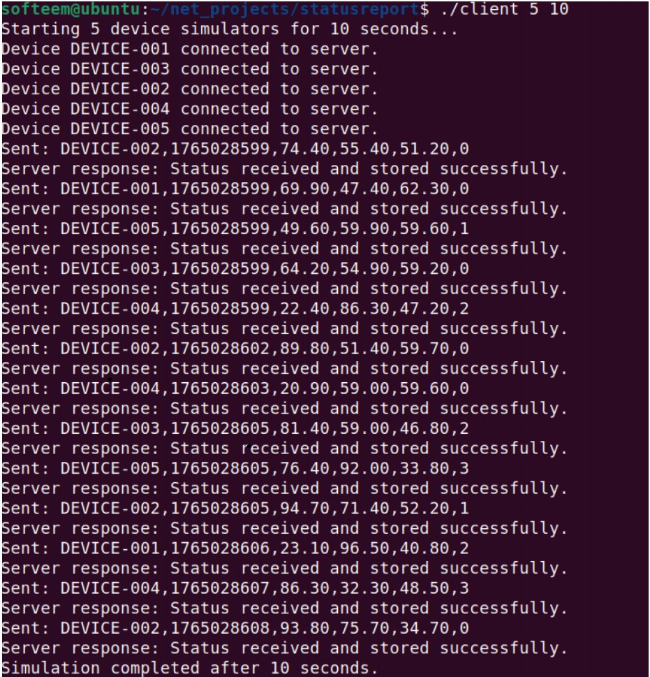
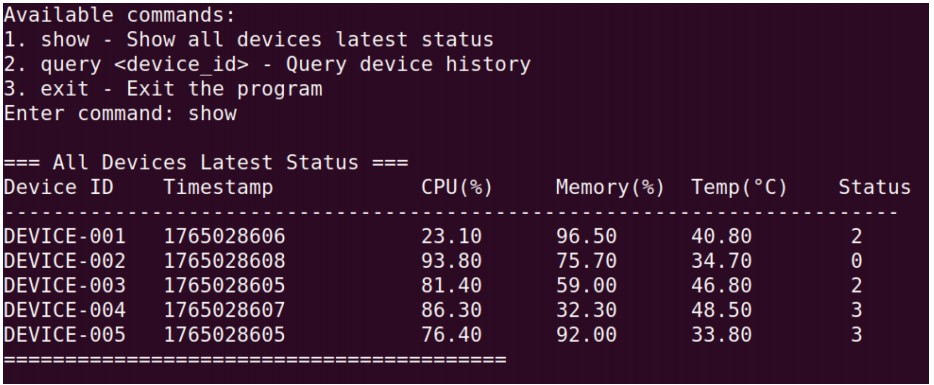
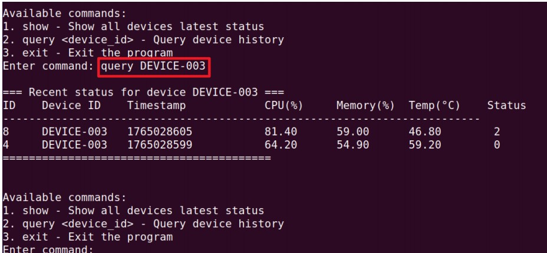

# 设备状态上报模拟系统
基于C语言开发的TCP多线程设备监控模拟系统，服务端支持多客户端并发接入，接收设备上报数据并持久化存储到SQLite数据库，客户端模拟多台设备周期性上报状态信息。

## 项目功能
1. 服务端：TCP端口监听，多线程处理多个设备连接，接收设备上报数据，写入数据库
2. 客户端：模拟设备，定时生成设备状态数据，通过TCP连接上报给服务端
3. 数据存储：SQLite数据库保存设备编号、上报时间、各项状态指标
4. 工具模块：提供字符串处理、时间获取等通用辅助函数

## 文件说明
- `server.c`：服务端主程序，负责端口监听、创建子线程处理客户端连接
- `client.c`：模拟设备客户端，循环生成模拟数据，向服务端发送上报报文
- `config.h`：全局宏定义，包含端口号、缓冲区大小、数据库名等配置
- `network.h / network.c`：网络通信封装，TCP连接、收发数据基础函数
- `database_server.h / database_server.c`：SQLite数据库初始化、数据插入查询模块
- `utils.h / utils.c`：通用工具函数，时间格式化、字符串处理等辅助功能
- `query.h / query.c`：数据库查询模块，用于读取历史设备上报记录
- `Makefile`：项目编译脚本，一键编译服务端与客户端可执行文件
- `.gitignore`：Git忽略配置，不提交编译产生的可执行文件、临时文件

## 使用说明
客户端：
- ./client 5 60 # 启动5个设备，运行60秒，每个设备的状态数值随机生成
状态数据包括：CPU占用率、内存占用率、温度、状态码(0到 5)
- 服务器启动后，可以使用以下命令：
- show - 显示所有设备的最新状态（各设备最近一笔的数据）
- query DEVICE-001 - 查询特定设备的历史数据 DEVICE-001是设备名
- exit - 退出程序
- 查询端：
- ./query # 显示统计信息（记录总数、设备总数）和最近记录（最近10条）
- ./query DEVICE-001 # 查询特定设备所有记录
- ./query stats DEVICE-001 # 显示设备统计信息（设备ID、记录总数、平均CPU占用率，平均内存占用
率，平均温度）

# 编译
make

